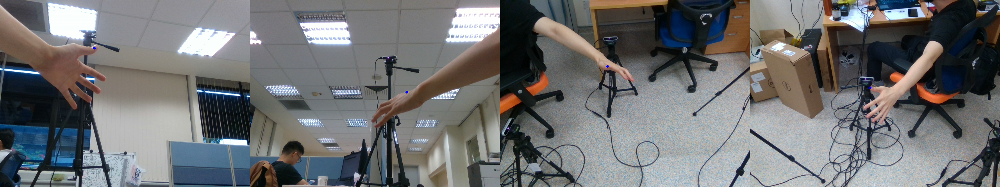

- [Intel RealSense multi-camera calibration and Tips for recording data](#intel-realsense-multi-camera-calibration-and-tips-for-recording-data)
- [Intrinsic parameters](#intrinsic-parameters)
- [Extrinsic parameters](#extrinsic-parameters)
- [Measure System Error](#measure-system-error)
- [Measure System Error without Depth information](#measure-system-error-without-depth-information)
- [Tip for recording data](#tip-for-recording-data)
- [Step by step recording data](#step-by-step-recording-data)

# Intel RealSense multi-camera calibration and Tips for recording data
 - D415 color and depth cameras.

# Intrinsic parameters
  - RealSense camera D415 is fix focus
  - the distance between cameras and chessboard is around 50cm to 100cm. 70 cm is better.
  - If we use OpenCV [tools](https://docs.opencv.org/2.4/modules/calib3d/doc/camera_calibration_and_3d_reconstruction.html) to get intrinsic parameters, the standard deviation of intrinsic parameters for each camera is:
    - camera_0:2.86
    - camera_1:7.4273
    - camera_2:1.2344
    - camera_3:3.029
  - If we use Intel official tools to get intrinsic parameters.
    - for RGB cameras, we can get same intrinsic parameters for seven times.
    - for depth cameras, the standard deviation of intrinsic parameters for each camera is:
      - camera_0:fx:0.026:fy:0.023
      - camera_1:fx:0.07:fy:0.05
      - camera_2:fx:0.35:fy:0.06
      - camera_3:fx:0.022:fy:0.027
      - mean of fx and fy is around 615
    
  
# Extrinsic parameters
  - we want to find extrinsic parameters among four cameras.
  - we hold a chessboard, and record a videos. We find some key frames, which at least two cameras can capture the chessboard, and then use cv2.aruco.estimatePoseBoard to get relative poses.
    - by such method, we get a sequence of extrinsic parameters, the standard deviation of coordinate because of different extrinsic parameters is 3.82mm. 
  - we need to consider the [asynchronous among multicameras](https://simplecore.intel.com/realsensehub/wp-content/uploads/sites/63/Multiple_Camera_WhitePaper04.pdf) when we do calibrations. 
    - we use such method to prevent the influence from asynchronization. We use a paper to cover the chessboard when we **move** the chessboard and remove the paper when the chessboard is statics.
    - by such method, we get a sequence of extrinsic parameters, the standard deviation of coordinate because of different extrinsic parameters is 0.4mm(0.92 std for pixel level).
    
# Measure System Error
  - depth accuracy >= 98 percent for realsense D415
  - We want to measure the system error, which includes **intrinsic parameters**, **extrinsic parameters**, and **depth error**.
    - Use different camera configurations(different distance between cameras)
    - Use different video frames to do camera calibrations.
    - Select a point in the , which can be captured by all four cameras. Using intrinsic/extrinsic parameters and depth information, we can transfer the point in each camera space into one single camera space, and then we can calculate the STD for same points from four different space. The STD is 4.6 mm, which means our system error is 4.6 mm.

# Measure System Error without Depth information
 - We know that depth information is not accurate, which is the most influential part for the system error. From quantitative results, we can find that STD of extrinsic parameters and intrinsic parameters are small, which is less than 1mm. We also tried to adjust the camera depth by hand, and then we can match points from different views better.
 - Therefore, we tried use 3D reconstruction method, which means we match points for different views .
 - This time, the system error includes, **intrinsic parameters**, **extrinsic parameters**, and **hand labeling**. We select the same point(visually, the hand labeling error comes from here) from the tip of index finger, the tip of Middle finger, and the thumb in different views. We transfer the points from four different views to one single view, and then we can calculate the STD for same points from four different space. The std of x in pixel level is around 2, and std of y in pixel level is around 1.5 since we do not use depth information here so we cannot get the real coordinates in 3D space.

# Tip for recording data
 - Hardware
   - connect cameras to the PC with fast CPU
   - slow PC makes images of video blurred
 - The distance between hand and camera should be short, since short distance means less error. 
   - we need to set "rs.rs400_advanced_mode(dev).get_depth_table().disparityShift = 30" to make the camera see objects clearly in the short distance.
 - Hands should be far from desk, and then we can crop hands easily.
 - We should move hand slowly when we recording the data, which can reduce the influence of asynchronization from multicameras and blurred images.
 - When we do camera calibration, we should make the chessboard near to the cameras, which can cause less system errors.
 - If we wear gloves when we recording the data, we should not make the gloves cover the wrist.

# Step by step recording data
 - first, we need to do camera calibration. We record a video. We need to make the chessboard captured by each of two cameras during some frames. Please refer to extrinsic parameters section for more details.
 - recording depth and color hand videos with a blue or red glove, but not let the glove cover the wrist.
 - using color as masks (ground true data) for depth images, training a neural network to separate hand from background.
   - train: depth image of hand with a glove, hand mask. Inference: depth image of hand **without** gloves
 - using a unsupervised learning method which provided by the paper: Dual Grid Net: hand mesh vertex regression from single depth maps. We can get hand joint locations from depth images.
 - If we use the unsupervised learning directly, we cannot get very accurate results. Here we use a semi supervised learning method. We hand labeled 40 frames of images. By using these images, we use supervised learning to guide the model to better results.

 
